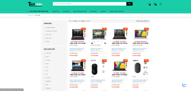
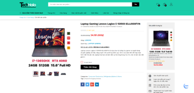
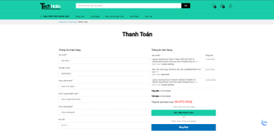
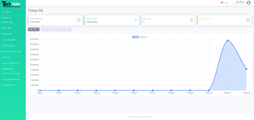

# 📌 Laptop E-Commerce Website (Fullstack)

> Một dự án website bán hàng máy tính TechHalo. Dự án áp dụng nhiều công nghệ mới nhầm hỗ trợ chủ doanh nghiệp quản lý, cũng nhưng cải thiện trải nghiệm người dùng.

---

## 📷 Giao diện trang web

### 🏠 Giao diện trang chủ


### 🛒 Giao diện trang cửa hàng


### 📄 Giao diện trang chi tiết sản phẩm


### 💳 Giao diện trang thanh toán


### 📊 Giao diện Dashboard


---

## 🎯 Tính năng nổi bật

- ✅ Đăng nhập/Đăng ký với JWT  
- ✅ Phân quyền người dùng: Admin vs User  
- ✅ Giỏ hàng, thanh toán, mã giảm giá  
- ✅ CRUD sản phẩm, đơn hàng, thống kê  
- ✅ Giao diện responsive & hiện đại  

---

## 🧰 Công nghệ sử dụng

### Frontend:

- Angular (CLI 12+)  
- Angular Material, SCSS  
- RxJS, ngx-pagination, toastr, slick-carousel  
- Chart.js, jsPDF, SweetAlert2  

### Backend:

- Java 17, Spring Boot 2  
- Spring Security + JWT  
- MySQL, JPA (Hibernate)  
---

## 🎬 Video demo

[](https://www.youtube.com/watch?v=xab75wW7rB4)


## ⚙️ Cài đặt & chạy thử

### Frontend

1. Cài đặt các package:

```bash
npm install
```
2. Chạy server Angular:

```bash
ng serve
```

3. Mở trình duyệt truy cập:

➡️ [http://localhost:4200](http://localhost:4200)

### Backend:

1. Cấu hình application.properties

2. Chạy ứng dụng Spring Boot:

- Chạy trực tiếp trong IDE hoặc dùng lệnh sau trong terminal:

```bash
./mvnw spring-boot:run
```

3. Cổng truy cập backend mặc định:

➡️ [http://localhost:4200](http://localhost:8080)

